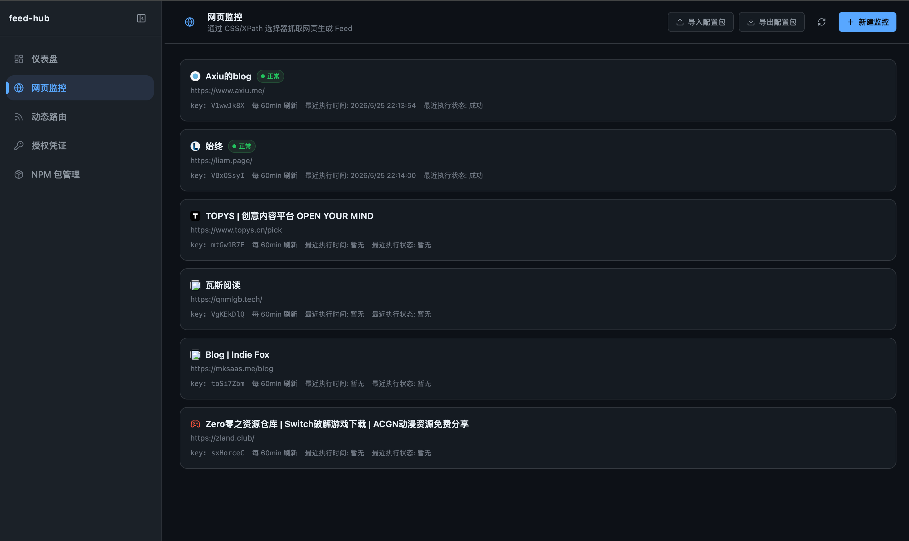
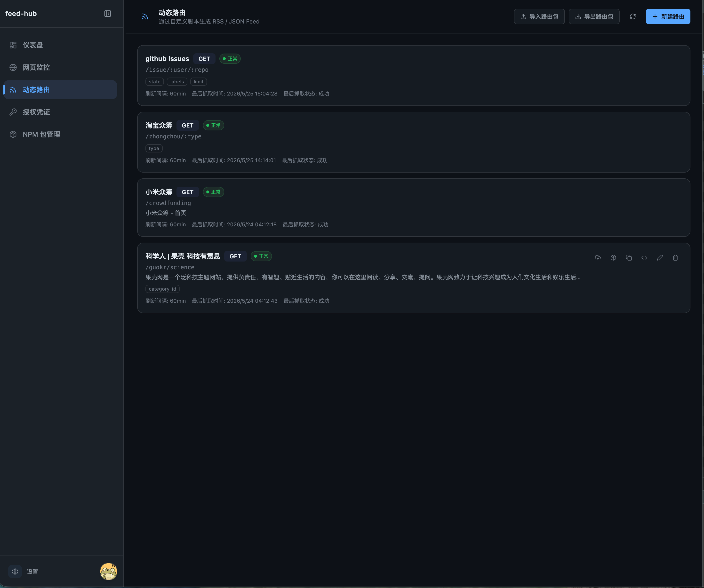
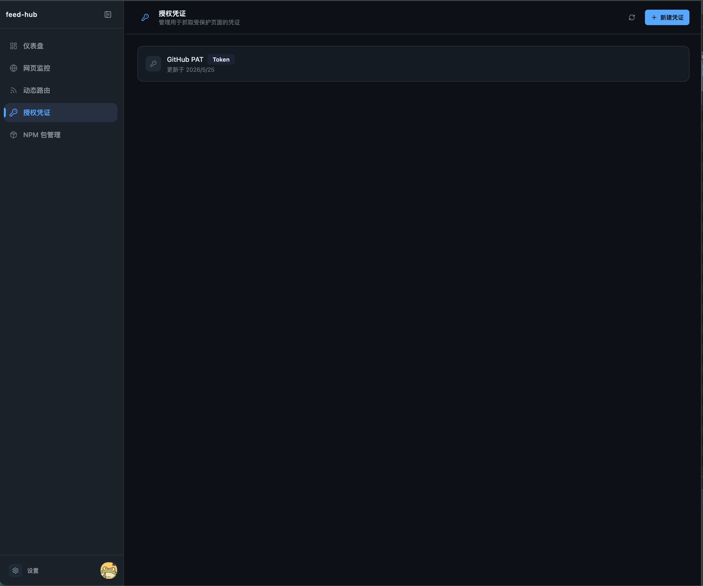
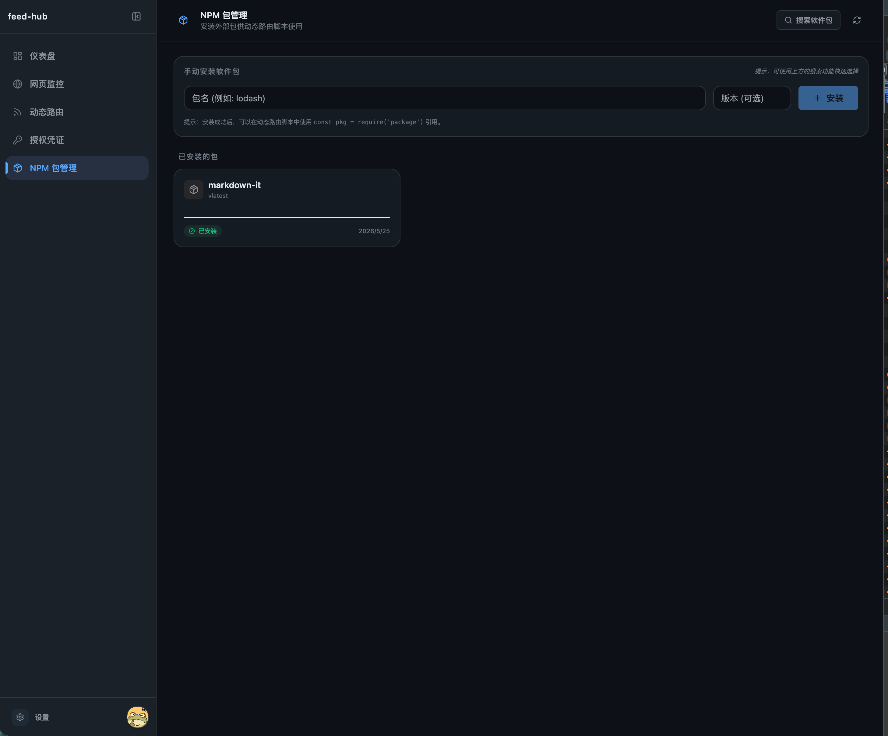
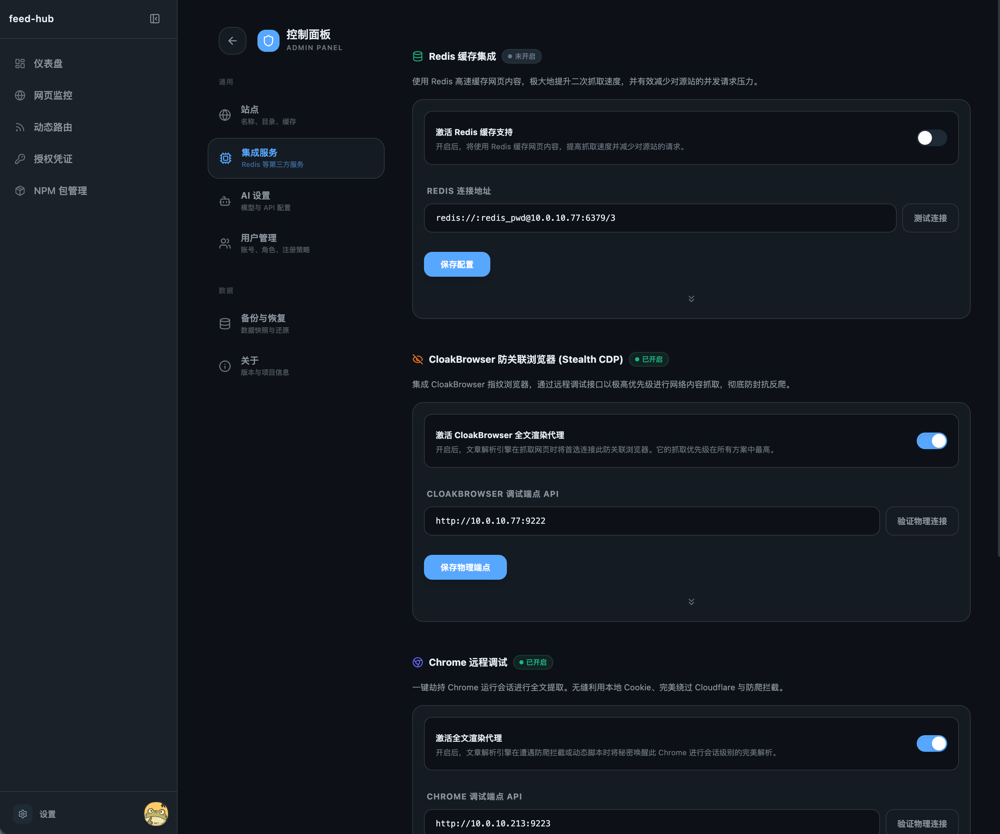

# FeedHub 🚀

<div align="center">

**一个强大、可扩展的动态 RSS 订阅源与 API 生成平台**

支持安全沙箱化脚本运行、标准 NPM 依赖管理、多渠道消息通知以及多款主流 AI 智能助手集成。

[](https://pnpm.io/)
[](https://hono.dev/)
[](https://react.dev/)
[](https://www.electronjs.org/)
[](https://capacitorjs.com/)
[](LICENSE)

[简体中文](./README.md) | [English Document Coming Soon](./README.md)

</div>

---

## 📖 简介

**FeedHub** 是一个专为内容聚合与自动化流程设计的动态 RSS/API 订阅源生成平台。它能够通过安全的 JavaScript 沙箱环境，在服务器端运行用户自定义的网页解析脚本，从而快速将任何不提供 RSS 订阅的网页转化为标准的 **RSS 2.0** 或 **JSON Feed** 订阅源。

本系统采用现代 Monorepo 架构开发，同时集成了多端能力（Web 端、桌面 Electron 端、Android Capacitor 移动端），并深度接入各大主流 AI 模型，可自动进行内容的智能分析与多语言翻译，是构建个人知识库和信息流自动化（如 IFTTT / Zapier）的得力助手。

---

## 📸 界面预览

以下是 FeedHub 系统的核心功能界面预览：

<div align="center">
  <p>
    <strong>📊 控制面板与 RSS 订阅源管理</strong><br/>
    
  </p>
  <br/>
  <p>
    <strong>⚙️ 动态路由配置与物理沙箱运行</strong><br/>
    
  </p>
  <br/>
  <p>
    <strong>🤖 AI 智能助手与大模型服务商配置</strong><br/>
    
  </p>
  <br/>
  <p>
    <strong>📢 全局通知推送与事件监测设置</strong><br/>
    
  </p>
  <br/>
  <p>
    <strong>💾 数据定时备份与在线一键恢复</strong><br/>
    
  </p>
</div>

---

## 🛠️ 技术栈

FeedHub 的前后端及跨端架构均基于目前最先进的现代 Web 技术构建：

| 分类 | 核心技术 & 依赖 | 说明 |
| :--- | :--- | :--- |
| **前端 (Frontend)** | React 18, Vite, TypeScript, Tailwind CSS | 采用 React 开发的高效 UI，极致响应速度与现代设计美学 |
| **动画 & 交互** | Framer Motion, Radix UI | 提供丝滑的过渡动效和无障碍可访问的基础组件 |
| **后端 (Backend)** | Hono, Node.js Server, Better-SQLite3 | 基于 Hono 开发的高性能 RESTful API，搭配 SQLite 进行极速轻量存储 |
| **沙箱脚本层** | `isolated-vm` | 核心模块。采用 V8 引擎底层隔离，确保自定义解析脚本安全、独立运行 |
| **包管理器** | pnpm Workspace | Monorepo 多包管理，利用硬链接提供极速且节省磁盘的 NPM 依赖共享 |
| **桌面端 (Desktop)** | Electron | 将 Web 应用完美包装为桌面客户端，并提供专属的桌面级配置支持 |
| **移动端 (Mobile)** | Capacitor (Android) | 提供快速打包为原生 Android App 的能力，支持移动端自适应布局 |
| **AI 助手集成** | DeepSeek, OpenAI, Gemini, 豆包, 通义千问, Ollama | 接入各大国内外主流大模型，支持自动内容分析、总结与翻译 |

---

## 📂 项目结构

项目基于 `pnpm-workspace` 采用 Monorepo（单仓库）形式组织，清晰分离前端、后端与跨端外壳：

```text
FeedHub/
├── frontend/                   # 前端 SPA (Vite + React + TS + Tailwind)
│   ├── src/                    # 源码 (包含核心组件、Hook 以及 ThemeProvider)
│   └── package.json            # 前端依赖配置
├── backend/                    # 后端服务 (Hono + Better SQLite3)
│   ├── src/                    # 后端源码
│   │   ├── services/           # 核心服务 (backup-restore, webhook 推送等)
│   │   └── index.ts            # 后端入口
│   ├── data/                   # 本地数据库与动态路由解析脚本目录
│   └── package.json            # 后端依赖配置
├── electron/                   # 桌面端 Electron 包装与主进程入口
├── scripts/                    # 项目脚手架与自动化初始化脚本
├── docs/                       # 系统详细说明文档
│   ├── API_GUIDE.md            # 系统全面 API 规格与字段说明
│   └── guidelines/             # 代码风格、提交规范与 UI 设计指南
├── docker-compose.yml          # Docker 一键编排容器配置
├── Dockerfile                  # 多阶段构建多端打包镜像 Dockerfile
├── package.json                # 根目录全局 package.json (包含工作区联控脚本)
└── pnpm-workspace.yaml         # pnpm 工作区配置文件
```

---

## ✨ 核心功能亮点

### 🚀 1. 动态路由脚本与高级依赖隔离
- **物理沙箱安全运行**：基于 `isolated-vm`，每个脚本都在隔离的 V8 虚拟机上下文中执行，无法直接访问宿主系统文件或网络，保证核心服务器安全。
- **项目级独立依赖**：支持以标准 NPM 项目结构开发解析脚本。每个路由项目可拥有自己的 `package.json`。点击“安装项目依赖”即可独立拉取第三方依赖库。
- **基于 pnpm 的存储优化**：底层采用 **pnpm** 硬链接机制管理。多脚本使用相同的包时物理磁盘**仅占一份空间**，安装如闪电般快速且极大节省磁盘。
- **一键 GitHub 同步 / Zip 上传**：支持公开或私有 GitHub 仓库同步（需配置 Access Token），亦可直接上传包含完整依赖与说明的 `.zip` 脚本项目包。

### 🤖 2. 多款 AI 智能助手深度集成
系统内嵌了渐变色极美卡片式的 AI 服务提供商管理界面，支持实时连通性测试与可用模型列表自动拉取，您可以根据需求自由配置：

- **OpenAI** (默认模型：`gpt-4o-mini`)
- **Google Gemini** (默认模型：`gemini-2.0-flash`)
- **DeepSeek** (默认模型：`deepseek-chat`)
- **通义千问** (默认模型：`qwen-plus`)
- **火山引擎豆包** (默认模型：`doubao-1.5-pro-32k`)
- **本地 Ollama** (默认模型：`qwen2.5:7b` - 部署简单，无需网络与 API Key，完美支持本地断网隐私推理)

### 📢 3. 全局通知推送与事件监测
提供多渠道推送服务（设置中可随时开启/关闭并发送联通性测试），在以下事件发生时将向您的移动端或工作软件发送即时通知：
- 静态/目标网页抓取失败 (如目标网站崩溃或改版)
- 沙箱内自定义动态路由脚本抛出异常
- 系统后台 NPM 依赖拉取/安装失败
- **支持渠道**：**Bark** (iOS 推送工具)、**飞书 Webhook** 机器人群通知

---

## 🚀 安装与部署

> [!NOTE]
> **默认管理员账号信息：**
> - **用户名**：`admin`
> - **密  码**：`admin123`
>
> *安全提示：首次登录后，强烈建议您立即前往「设置 → 账号安全」中修改初始密码。*

### 方式一：本地极速启动（开发 / 体验）

**环境要求**：Node.js 20+、Git、pnpm (推荐，如未安装可使用 `npm i -g pnpm`)

```bash
# 1. 克隆本项目
git clone https://github.com/fillpit/FeedHub.git
cd FeedHub

# 2. 安装所有工作区依赖 (底层将自动并行处理 frontend 与 backend 依赖)
pnpm install

# 3. 初始化本地配置与数据库
pnpm run init

# 4. 并行启动前端开发服务与后端 API 服务
pnpm dev
```

- 前端开发服务将自动在 `http://localhost:5173` 启动，并自动代理 `/api/*` 请求至后端服务的 `3001` 端口。
- 数据库文件默认保存在 `backend/data/feed_hub.db` (原 node-template.db)，直接备份此 SQLite 文件即可迁移或保存所有数据。

---

### 方式二：Docker Compose 容器部署（生产推荐）

适用于各类 Linux / macOS / Windows 等已安装 Docker 的服务器或群晖等 NAS 平台。

**步骤 A：使用 docker-compose 一键启动**

```bash
# 1. 下载项目
git clone https://github.com/fillpit/FeedHub.git
cd FeedHub

# 2. 一键在后台构建并启动容器
docker-compose up -d
```

**步骤 B：独立 Docker 运行**

如果您不需要 compose，也可以直接基于 Dockerfile 构建并运行容器：

```bash
# 构建镜像
docker build -t feedhub:latest .

# 运行容器 (映射 3001 端口并挂载数据盘)
docker run -d \
  -p 3001:3001 \
  -v /path/to/host/data:/app/backend/data \
  --name feedhub \
  feedhub:latest
```

---

## 💡 通用注意事项与最佳实践

- 💾 **数据持久化**：使用 Docker 部署时，务必将容器内的 `/app/backend/data` 目录映射到宿主机，否则更新或重启容器后，数据库和自定义解析脚本将会丢失。
- 🔄 **数据库备份与在线恢复**：系统支持在线创建、下载与一键恢复备份（通过 `/api/backups`）。同时，服务启动后会自动开启**每 24 小时自动备份**机制，系统默认保留最近 10 个自动备份文件。
- ⚙️ **跨域与安全配置**：首次登录请务必修改密码。若需要外网公开访问，建议使用 Nginx、Caddy 或 Traefik 进行反向代理并配置 HTTPS 证书。
- 🤖 **本地大模型 (Ollama)**：若需要实现完全断网的 AI 智能总结和翻译，可配置您的本地 `OLLAMA_URL` 并将其设置为宿主机的 Ollama 接口地址。

---

## 🔌 API 接口与开发参考

FeedHub 后端采用了一套标准化且高度健壮的 RESTful 接口体系。

对于详细的接口规格说明（例如 **NPM 依赖安装卸载**、**通知渠道设置** 以及 **动态路由抓取生成** 的路径与 JSON 载荷），请查阅详细文档：
👉 [**FeedHub 后端 API 设计与规格说明文档 (docs/API_GUIDE.md)**](./docs/API_GUIDE.md)

### 典型动态订阅获取示例：
```http
GET /api/dynamic/sub/issue/microsoft/vscode?type=rss
Authorization: Bearer <your_jwt_token>
```
*提示：获取动态 Feed 支持末尾斜线自动修正，以及非占位符验证，参数支持从脚本的 `params` 自行解析渲染。*

---

## 🤝 参与贡献

我们非常欢迎并感谢您对 FeedHub 的任何贡献！
- 如果您发现了 Bug 或有新功能设想，请随时提交 [Issue](https://github.com/fillpit/FeedHub/issues)。
- 如果您想提交代码，请遵循我们的 [TypeScript 编写规范](./docs/guidelines/coding-style.md) 与 [Git Commit 规范](./docs/guidelines/commit-convention.md)，并提交 Pull Request。

## 📄 开源许可证

本项目基于 **[MIT License](LICENSE)** 开源协议发布，可自由用于个人学习、商业用途等，但请保留原作者的版权声明。
